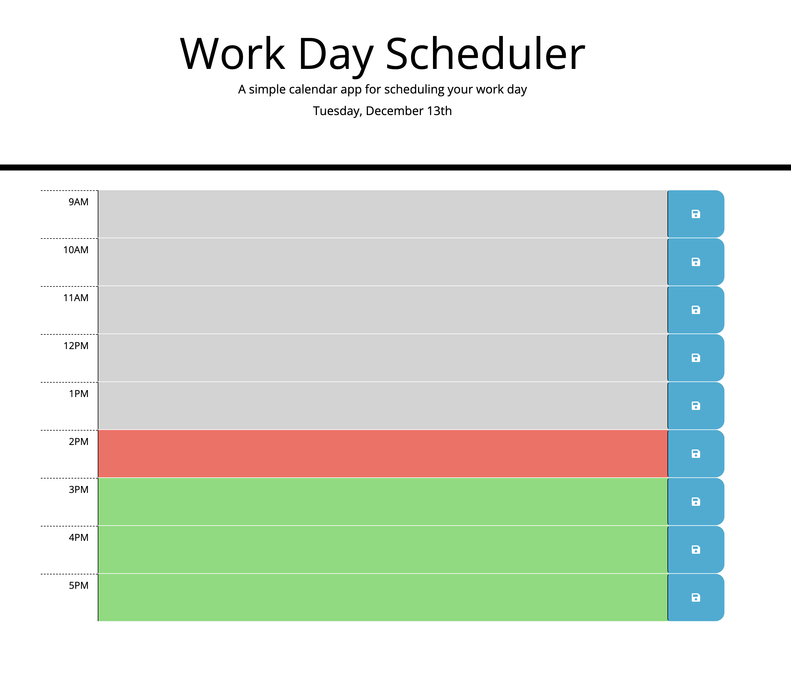

# Daily Planner App

## Description

This Challenge requires DOM manipulation, advanced JavaScript, integration of third-party APIs, and more. This app runs in the browser and features dynamically updated HTML and CSS powered by jQuery.

## Installation

N/A

## Usage

[Demo URL](https://celiyo.github.io/daily-planner-app/)

The app should:

- Display the current day at the top of the calender when a user opens the planner.
- Present time blocks for standard business hours when the user scrolls down.
- Color-code each time block based on past, present, and future when the time block is viewed.
- Allow a user to enter an event when they click a time block
- Save the event in local storage when the save button is clicked in that time block.
- Persist events between refreshes of a page.

## Credits

N/A

## License

This project is open source and available under the [MIT License](LICENSE).
